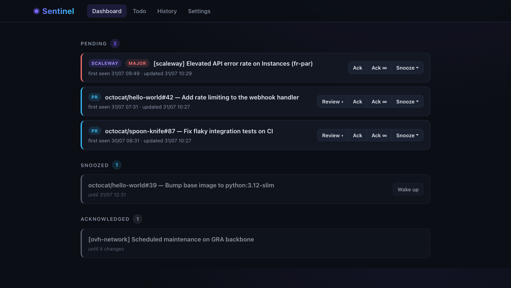

# Sentinel 🛰️

> A tiny self-hosted watchtower for things that need your attention — GitHub PRs waiting for your review and status page incidents — with native Web Push notifications and a built-in ack/snooze workflow.




## What it does

- 👀 **GitHub review requests** — polls PRs where your review is requested (directly or via a team) across your orgs. Inline review panel on the dashboard: diff, CI checks, one-click **Approve**.
- 🚦 **Status pages** — watches any [Atlassian Statuspage](https://www.atlassian.com/software/statuspage) API (Scaleway, OVHcloud, GitHub, Cloudflare, …) with component/keyword filters, so you only hear about incidents that affect *your* infra.
- 🔔 **Web Push notifications** — native OS notifications through your browser (Chrome/Firefox), no third-party service.
- ✅ **Ack / snooze workflow** — every item nags you exactly once, then stays silent until something actually changes.
- 📝 **Minimal todo list** — replaces the paper notepad next to your keyboard.

Everything runs locally in a single Docker container with a SQLite file — no accounts, no cloud, no telemetry.

## Quick start

```bash
git clone https://github.com/vgazelot/sentinel.git && cd sentinel

# 1. Configuration: set your GitHub login/orgs and the status pages you care about
cp config.example.yaml config.yaml

# 2. Secrets: add a GitHub token (quick bootstrap: gh auth token)
cp .env.example .env

# 3. Generate the Web Push (VAPID) keys and paste them into .env
docker compose build
docker compose run --rm sentinel python gen_vapid.py

# 4. Run
docker compose up -d
```

Open **http://localhost:8300** — then go to **Settings → Subscribe this browser** to enable notifications (use `localhost`, not `127.0.0.1`: the service worker origin depends on it).

> [!WARNING]
> Sentinel has **no authentication**. It is designed to run on your own machine, bound to `127.0.0.1` (the default in `docker-compose.yml`). Never expose it to a network.

## How ack / snooze works

| Action | Effect |
|---|---|
| **Ack** | Silent until the item *changes* (new push/comment on the PR, new incident update) |
| **Ack ∞** | Never notify again for this item |
| **Snooze** | Re-notifies when it expires (30 min / 1 h / 4 h / tomorrow 9am) |
| — | Item gone from the source (PR merged/reviewed, incident resolved) → auto-resolved |

## Configuration

`config.yaml` (mounted read-only — restart after editing: `docker compose restart`):

```yaml
watchers:
  github_reviews:
    enabled: true
    interval_seconds: 180
    login: your-github-username
    orgs: [your-org]

  statuspage:
    enabled: true
    interval_seconds: 300
    instances:
      - name: scaleway
        url: https://status.scaleway.com/api/v2/summary.json
        components: [Instances, Object Storage]   # an affected component must match (substring)
        keywords: []                               # extra AND filter, matched at word start
        include_maintenances: true
```

Any status page exposing `/api/v2/summary.json` works. `components` and `keywords` keep the noise down: `keywords: [gra]` matches `GRA1` but not `degraded`.

Environment variables (`.env`):

| Variable | Purpose |
|---|---|
| `GITHUB_TOKEN` | Lists PRs waiting for your review. A fine-grained PAT with read-only PR access is enough; the **Approve** button needs a classic PAT with `repo` scope |
| `VAPID_PRIVATE_KEY` / `VAPID_PUBLIC_KEY` | Web Push keys — generate with `docker compose run --rm sentinel python gen_vapid.py` |
| `VAPID_CLAIM_EMAIL` | Contact email embedded in push claims (any address you own) |
| `TZ` | Timezone for local time display and "snooze until tomorrow 9am" (default `UTC`) |

## Fallback notifier (macOS, optional)

Web Push only works while a subscribed browser is running. `contrib/host-notifier/` provides a launchd agent that polls the API and relays pending notifications through [`terminal-notifier`](https://formulae.brew.sh/formula/terminal-notifier):

```bash
brew install terminal-notifier
# edit the plist first: replace /path/to/sentinel with your clone path
cp contrib/host-notifier/com.example.sentinel-notifier.plist ~/Library/LaunchAgents/
launchctl load ~/Library/LaunchAgents/com.example.sentinel-notifier.plist
```

## Architecture

Flask 3 + APScheduler (in-process, hence the single gunicorn worker) + SQLite (WAL) + HTMX. A watcher is one class with a `fetch()` returning the current state; `engine.py` diffs it against the stored state and drives the ack/snooze state machine. Adding a watcher = one file + one registry line + one config block — see [CLAUDE.md](CLAUDE.md) for the full tour.

## License

[MIT](LICENSE)
